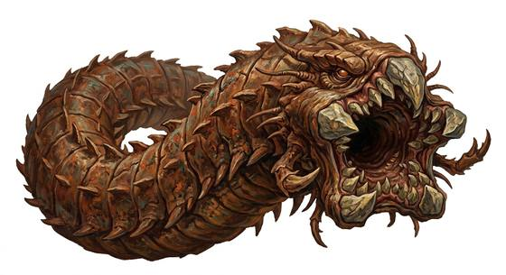

# Colossal sand wyrm

{.illus}

*Set: Expansion*

*aka: ______________________________*

*[Serpentine](../Species_Families/serpentine.md) · gigantic serpentine · burrower · sci-fi, fantasy*

A worm so vast that its round mouth could swallow a caravan, a war machine or a whole camp in a single rise. Its hide is ridged and weathered like a dune, and it moves beneath the desert so deep that only a slow ripple on the surface shows where it is.

It is drawn by rhythm: drums, hammering, marching feet, the thump of engines. Anything that pounds a steady beat into the sand will call it from leagues away. It rises underneath and engulfs everything. It has no fear and never flees. Desert peoples walk with a broken step, and some have learned to use it as a weapon against their enemies.

## Stat block

- **Attack** 23 · **Parry** — · **Dodge** -2 · **Armour** 5 · **Life** 76 · **Threat** 20+
- **Attacks (3 a round):** great bite 2d6+2
- **Attributes:** STR 30 DEX 5 AGI 5 END 30 INT 1 WIS 8 PER 13 CHA 2 COU 20
- **Skills:**, [Survival: Desert](../Skills/survival-desert.md) +5 (reroll 2)
- **Powers:** [Burrowing](../Powers/burrowing.md) 5, [Toughness](../Powers/toughness.md) 5, [Radar Sense](../Powers/radar-sense.md) 3
- **Behaviour:** drawn by rhythm; engulfs vehicles and entire camps. **Morale:** mindless, never flees.

How to read this block: [Bestiary](../bestiary.md).

## Not to be confused with

the *[great tunnel worm](great-tunnel-worm.md)*, which bores through rock and swallows riders; the sand wyrm is far larger, lives in deserts and swallows camps.

