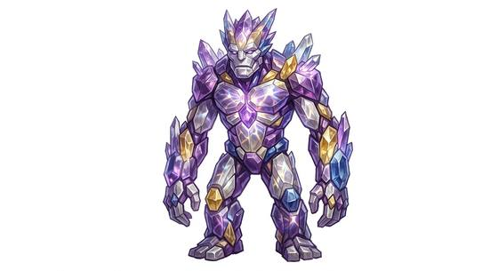

# Crystal elemental

{.illus}

*Set: Expansion*

*aka: ______________________________*

*[Elemental-kind](../Species_Families/elemental-kind.md) · large biped · slow · fantasy*

A glittering giant of living gemstone and quartz, found deep underground where crystals grow. Its body is jagged and faceted, pink, violet or clear, and it rings faintly when it moves. Light passes through it and splits into brilliant beams.

It refracts light into blinding bursts, and its hard body shatters blades that strike it. It is mindless and never flees. It moves slowly and only fights when its caverns are disturbed, which miners seeking gems do often. Hammers and picks harm it more than swords. Its broken body is worth a fortune, which is why miners keep going back.

## Stat block

- **Attack** 20 · **Parry** — · **Dodge** 4 · **Armour** 4 · **Life** 38 · **Threat** 3+
- **Attacks:** blade arms 1d6+2
- **Attributes:** STR 22 DEX 8 AGI 8 END 22 INT 2 WIS 8 PER 11 CHA 3 COU 20
- **Skills:** [Brawling](../Weapon_Groups/brawling.md) +4
- **Powers:** [Blinding Flash](../Powers/blinding-flash.md) 2, [Deflect & Reflect](../Powers/deflect-and-reflect.md) 2, [Toughness](../Powers/toughness.md) 2
- **Behaviour:** refracts light into blinding beams; shatters blades. **Morale:** mindless, never flees.

How to read this block: [Bestiary](../bestiary.md).

## Not to be confused with

The *[Glass golem](glass-golem.md)*, a constructed figure of coloured glass; the crystal elemental is a living spirit of stone, grown rather than made.

