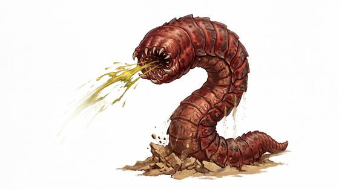

# Desert death worm

{.illus}

*Set: Core*

*aka: ______________________________*

*[Serpentine](../Species_Families/serpentine.md) · large serpentine · burrower · fantasy, myth, modern*

A thick, blood-red worm as long as a man is tall, living in the sands of the steppe deserts. It has no visible eyes or mouth, only a blunt head that swells when it is angry, and it spends most of its life deep under the sand.

It rises after rain, when the sand is wet and the air is heavy. Nomads say it can kill at a distance, either with a spray of caustic venom that corrodes metal and blinds or with a jolt that knocks a camel dead. Some say it is poisonous even to touch. Badly hurt, it sinks back into the sand. Herders avoid the desert entirely in the rainy season.

## Stat block

- **Attack** 17 · **Parry** — · **Dodge** 7 · **Armour** 2 · **Life** 26 · **Threat** 1+
- **Attacks:** bite 1d6+2
- **Attributes:** STR 15 DEX 11 AGI 11 END 16 INT 1 WIS 8 PER 8 CHA 2 COU 15
- **Skills:** [Stealth](../Skills/stealth.md) +5, [Survival: Desert](../Skills/survival-desert.md) +5
- **Powers:** [Burrowing](../Powers/burrowing.md) 3, [Acid & Corrosion](../Powers/acid-and-corrosion.md) 2, [Lightning](../Powers/lightning.md) 2
- **Behaviour:** rises after rain; spits acid and discharges shocks. **Morale:** flees when badly hurt.

How to read this block: [Bestiary](../bestiary.md).

## Not to be confused with

the *[giant burrowing worm](giant-burrowing-worm.md)*, a pale soil worm that bites; the death worm lives in desert sand and kills with acid and shocks.

