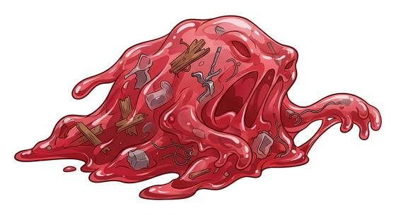

# Devouring blob

{.illus}

*Set: Expansion*

*aka: ______________________________*

*[Amorphous and ooze](../Species_Families/amorphous-and-ooze.md) · huge amorphous · slow · horror, modern, sci-fi*

A shapeless, pulsing mass that came from the sky in a meteor or escaped from a laboratory. At first it is small enough to hold in a hand. Then it eats.

It rolls slowly through towns, swallowing people whole and growing larger with every meal. It is mindless and never flees. Blades sink into it without harm. Cold is its weakness, and fire slows it. Towns that face it try to trap it in a cold store or lead it to an ice field. By the time most people take it seriously, it is the size of a house.

## Stat block

- **Attack** 19 · **Parry** — · **Dodge** -1 · **Armour** 0 · **Life** 52 · **Threat** 3+
- **Attacks (2 a round):** engulf 2d6
- **Attributes:** STR 24 DEX 4 AGI 4 END 26 INT 0 WIS 4 PER 4 CHA 0 COU 20
- **Skills:** [Wrestling & Grappling](../Weapon_Groups/wrestling-and-grappling.md) +5, [Climbing](../Skills/climbing.md) +3
- **Powers:** [Growing](../Powers/growing.md) 3, [Acid & Corrosion](../Powers/acid-and-corrosion.md) 2, [Toughness](../Powers/toughness.md) 3
- **Behaviour:** rolls through towns; grows with every meal. **Morale:** mindless, never flees.

How to read this block: [Bestiary](../bestiary.md).

## Not to be confused with

The *[Giant slime](giant-slime.md)*, an oversized slime that splits into smaller ones; the devouring blob grows larger with every victim it swallows.

