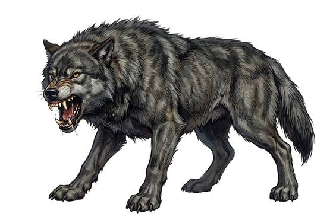

# Dire wolf

{.illus}

*Set: Core*

*aka: ______________________________*

*[Canine](../Species_Families/canine.md) · large quadruped · fast runner · prehistoric, fantasy, historical*

A heavy-jawed ice-age wolf the size of a pony, grey and shaggy, with a broad skull and teeth made for crushing bone. It hunts in big packs across cold steppes and forest edges, running down bison, horses and mammoth calves. The pack circles, harries and wears the prey out, then drags it down together.

Dire wolves fight while the pack fights, and they are cunning. Stone-age hunters compete with them for the same prey and sometimes lose. Their howls carry for miles on still nights. Some bands follow dire wolf packs to scavenge their kills, and some tell of strange alliances, cubs raised by humans that grew to hunt beside them.

## Stat block

- **Attack** 17 · **Parry** — · **Dodge** 9 · **Armour** 1 · **Life** 22 · **Threat** 1
- **Attacks:** bite 1d6+2
- **Attributes:** STR 14 DEX 13 AGI 13 END 14 INT 3 WIS 13 PER 17 CHA 5 COU 14
- **Skills:** [Tracking](../Skills/tracking.md) +5 (reroll 1), [Stealth](../Skills/stealth.md) +3
- **Powers:** —
- **Behaviour:** hunts in big packs; drags down large prey. **Morale:** fights while the pack fights.

How to read this block: [Bestiary](../bestiary.md).

## Not to be confused with

the *[grey wolf](grey-wolf.md)*, the ordinary wolf that hunts deer; the dire wolf is heavier, larger and brings down bison.

