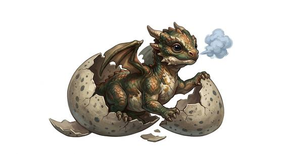

# Dragon hatchling

{.illus}

*Set: Expansion*

*aka: ______________________________*

*[Draconic](../Species_Families/draconic.md) · small winged quadruped · walk, weak flyer · fantasy*

A newborn dragon, no bigger than a cat, soft-scaled and still sticky from the egg. It is all eyes and appetite. Its wings are too small to carry it more than a few clumsy flaps, and when it tries to breathe fire, what comes out is a puff of smoke and an offended squeak.

Hatchlings are greedy, curious and quick to snap at fingers. They follow whoever feeds them, which is how many a farmer's child has ended up with a dangerous pet and many a thief with a valuable one. At the first real wound, a hatchling bolts for the nearest hole. Somewhere, usually, its mother is looking for it.

## Stat block

- **Attack** 12 · **Parry** — · **Dodge** 11 · **Armour** 2 · **Life** 12 · **Threat** minor+
- **Attacks:** bite 1d4; claws 1d4
- **Attributes:** STR 7 DEX 13 AGI 13 END 10 INT 5 WIS 10 PER 13 CHA 8 COU 11
- **Skills:**, [Stealth](../Skills/stealth.md) +2
- **Powers:** [Fire Blast](../Powers/fire-blast.md) 1
- **Behaviour:** greedy and curious; snaps at fingers; follows whoever feeds it. **Morale:** flees at first wound.

How to read this block: [Bestiary](../bestiary.md).

## Not to be confused with

the *[young wild dragon](young-wild-dragon.md)*, a half-grown beast big and fierce enough to hunt riders; the hatchling is small, soft and mostly harmless.

