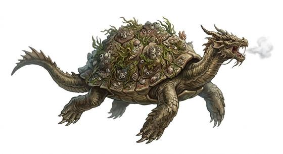

# Dragon turtle

{.illus}

*Set: Expansion*

*aka: ______________________________*

*[Draconic](../Species_Families/draconic.md) · gigantic quadruped · swimmer, slow · fantasy, myth*

A sea beast of colossal size with the head of a dragon and a domed shell crusted with coral, weed and barnacles. On the surface it drifts so still that sailors chart its back as a reef. Then the reef lifts, water pours off it in sheets, and a ship that was sailing calmly is suddenly lying on its side.

The dragon turtle surfaces beneath vessels to break them, and when it opens its mouth, it breathes a scalding cloud that boils the sea around it. Its shell turns spears and shot alike. It is slow and patient, and it fights to the death. Wise captains avoid waters where reefs appear on no chart.

## Stat block

- **Attack** 23 (rerolls 1) · **Parry** — · **Dodge** -1 · **Armour** 6 · **Life** 66 · **Threat** 20++
- **Attacks (3 a round):** great bite 2d6+2; claws 2d6+1
- **Attributes:** STR 30 DEX 6 AGI 6 END 33 INT 5 WIS 13 PER 17 CHA 6 COU 18
- **Skills:** [Swimming](../Skills/swimming.md) +5 (reroll 1) (reroll 1)
- **Powers:** [Fire Blast](../Powers/fire-blast.md) 3, [Water Breathing](../Powers/water-breathing.md) 4, [Toughness](../Powers/toughness.md) 4, [Invulnerability](../Powers/invulnerability.md) 1
- **Behaviour:** surfaces under ships; boils the sea with its breath. **Morale:** fights to the death.

How to read this block: [Bestiary](../bestiary.md).

## Not to be confused with

the *[island turtle](island-turtle.md)*, a sleeping giant too vast even to notice ships; the dragon turtle is smaller, hostile and breathes scalding steam.

