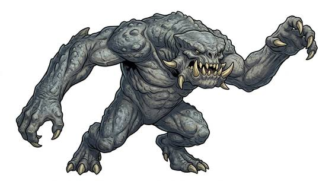

# Dungeon pit brute

{.illus}

*Set: Expansion*

*aka: ______________________________*

*[Reptilian](../Species_Families/reptilian.md) · huge biped · walk · sci-fi*

A towering, long-armed beast with a hide as thick as bark and a jaw big enough to take a man at the waist. Its eyes are small and mean, its fangs yellow, and its claws drag along the ground when it walks. Warlords keep them in pits under their palaces, and drop prisoners and debtors in to be eaten while guests watch from above.

It does not hunt so much as grab. Whatever is nearest is seized in those long arms and pushed towards the mouth. Wild ones roam in family groups in rocky country. Kept ones often have a devoted keeper who weeps when they die. For all its size, it will back off when badly hurt, and a heavy gate dropped at the right moment has ended more than one.

## Stat block

- **Attack** 22 · **Parry** — · **Dodge** 4 · **Armour** 2 · **Life** 44 · **Threat** 4
- **Attacks (2 a round):** smashing claws 2d6+1; great bite 2d6+1
- **Attributes:** STR 27 DEX 9 AGI 9 END 24 INT 4 WIS 8 PER 11 CHA 4 COU 16
- **Skills:** [Intimidation](../Skills/intimidation.md) +5
- **Powers:** [Toughness](../Powers/toughness.md) 2
- **Behaviour:** grabs the nearest morsel in its long arms and bites. **Morale:** flees when badly hurt.

How to read this block: [Bestiary](../bestiary.md).

## Not to be confused with

the *[four-armed cave brute](four-armed-cave-brute.md)*, which is small, fierce and defends a cave; the pit brute is a huge, slow grasping monster.

