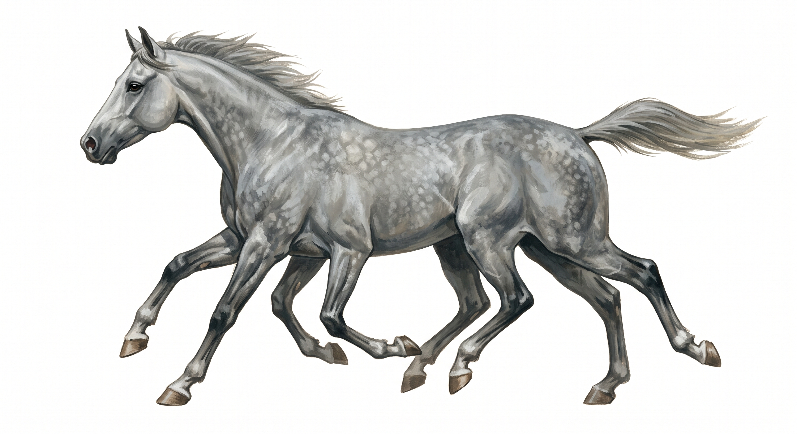

# Eight-legged horse

{.illus}

*Set: Expansion*

*aka: ______________________________*

*[Equine and centauroid](../Species_Families/equine-and-centauroid.md) · large quadruped · fast runner · fantasy, myth*

A great grey stallion with eight legs, set in pairs, that move in a rhythm no ordinary horse could manage. It is the swiftest steed ever foaled. It gallops over the sea without wetting its hooves and runs up the sky as though it were a road, and it can carry a rider down into other worlds and back again.

Only the greatest of riders ever sit on one, and most who try are thrown. It is not a fighter by nature, though its hooves can smash a shield, and it flees when badly hurt, which usually means it is simply gone. Some say those eight legs leave hoofprints on the stones of every road it has ever taken.

## Stat block

- **Attack** 20 · **Parry** — · **Dodge** 11 · **Armour** 1 · **Life** 30 · **Threat** 2
- **Attacks:** hooves 1d6+2
- **Attributes:** STR 20 DEX 15 AGI 15 END 25 INT 6 WIS 13 PER 13 CHA 12 COU 17
- **Skills:** [Running](../Skills/running.md) +5 (reroll 3), [Wayfinding](../Skills/wayfinding.md) +5 (reroll 1) (reroll 1)
- **Powers:** [Swift Travel](../Powers/swift-travel.md) 3, [Otherworld Passage](../Powers/otherworld-passage.md) 2
- **Behaviour:** gallops between worlds, over sea and sky. **Morale:** flees when badly hurt.

How to read this block: [Bestiary](../bestiary.md).

## Not to be confused with

the *[Eight-legged Saddle Beast](eight-legged-saddle-beast.md)*, a sturdy riding animal with many legs that never leaves the ground or this world.

