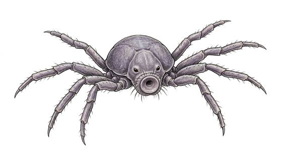

# Face-gripping egg parasite

{.illus}

*Set: Expansion*

*aka: ______________________________*

*[Hive and collective](../Species_Families/hive-and-collective.md) · tiny many-legged · fast runner · sci-fi, horror*

A pale, damp, spidery thing with long, finger-like legs and a muscular tail, about the size of a hand. It waits folded inside a leathery egg, and when something warm leans over, the egg opens and it springs straight onto the face. The legs lock around the head, the tail wraps the throat, and the host falls into a deep, unwakeable sleep.

While the host sleeps, it plants a larva deep inside. Then it drops away and dies. It is mindless and never flees. Pulling it off can strangle the host, and cutting it spills burning fluids. Those who have seen one learn to fear any leathery egg and never lean close to look.

## Stat block

- **Attack** 17 · **Parry** — · **Dodge** 16 · **Armour** 1 · **Life** 4 · **Threat** minor+
- **Attacks:** tail 1d4
- **Attributes:** STR 6 DEX 17 AGI 17 END 6 INT 1 WIS 8 PER 8 CHA 1 COU 20
- **Skills:** [Jumping](../Skills/jumping.md) +5 (reroll 1), [Stealth](../Skills/stealth.md) +4
- **Powers:** [Leap](../Powers/leap.md) 2, [Sleep](../Powers/sleep.md) 2
- **Behaviour:** leaps onto a face, knocks the host out, plants a larva. **Morale:** mindless, never flees.

How to read this block: [Bestiary](../bestiary.md).

## Not to be confused with

*[Face-clinging parasite](face-clinging-parasite.md)*, a similar face-grabbing creature; the egg parasite is the one that springs from a leathery egg and plants a larva.

