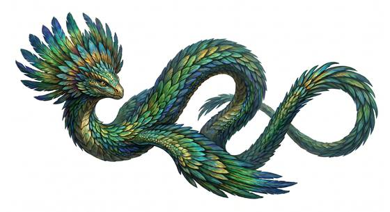

# Feathered sky serpent

{.illus}

*Set: Core*

*aka: ______________________________*

*[Serpentine](../Species_Families/serpentine.md) · large serpentine · fast flyer · fantasy, myth, historical*

A long, graceful serpent plumed from head to tail in feathers that shift from green to gold to violet as it turns. It flies without effort, riding the high winds above mountains and storms, and the air around it moves strangely: dust spins up, flags crack, and small birds are thrown off course.

Many peoples build temples on the heights it visits and call it sacred. It seldom troubles anyone. It avoids crowds, ignores offerings and leaves when approached, but if it is struck or cornered it lashes out with gusts that can knock a man flat. Hurt, it climbs into the clouds and is gone.

## Stat block

- **Attack** 19 · **Parry** — · **Dodge** 12 · **Armour** 2 · **Life** 29 · **Threat** 2+
- **Attacks:** constrict 1d6+2; bite 1d6+2
- **Attributes:** STR 17 DEX 16 AGI 16 END 17 INT 4 WIS 14 PER 19 CHA 12 COU 14
- **Skills:**, [Weather Sense](../Skills/weather-sense.md) +5, [Acrobatics](../Skills/acrobatics.md) +4
- **Powers:** [Flight](../Powers/flight.md) 4, [Wind Control](../Powers/wind-control.md) 2
- **Behaviour:** soars over temples and storms; avoids people unless attacked. **Morale:** flees when badly hurt.

How to read this block: [Bestiary](../bestiary.md).

## Not to be confused with

the *[amphiptere](amphiptere.md)*, a smaller, flocking winged serpent of forests; the sky serpent is solitary, larger and commands the wind.

