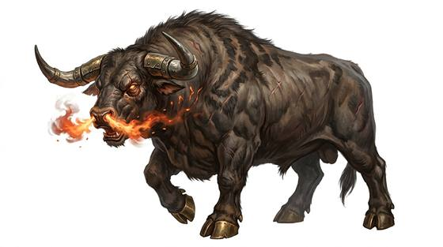

# Fire-breathing bull

{.illus}

*Set: Expansion*

*aka: ______________________________*

*[Ungulate](../Species_Families/ungulate.md) · large quadruped · walk · fantasy, myth*

A massive bull with bronze hooves that ring on stone and horns like polished spears. When roused, it snorts flame from its nostrils, and the fire can set fields alight and roast a man in his armour. It is often set to guard a sacred field or treasure, and it charges anything that enters.

It fights to the death, and fire does not harm it. Heroes in the old tales yoked it to a plough by magic, cunning or sheer strength, and ploughed the field it guarded. Those who try without such aid rarely leave the field.

## Stat block

- **Attack** 20 · **Parry** — · **Dodge** 5 · **Armour** 2 · **Life** 32 · **Threat** 2+
- **Attacks:** horns 2d6; hooves 1d6+2
- **Attributes:** STR 22 DEX 9 AGI 9 END 25 INT 2 WIS 9 PER 9 CHA 4 COU 18
- **Skills:** [Intimidation](../Skills/intimidation.md) +5
- **Powers:** [Fire Blast](../Powers/fire-blast.md) 2, [Resist Element](../Powers/resist-element.md) 3
- **Behaviour:** charges anything that enters its field. **Morale:** fights to the death.

How to read this block: [Bestiary](../bestiary.md).

## Not to be confused with

the *[fighting bull](fighting-bull.md)*, the ordinary bull bred for the ring; the fire-breathing bull is a mythic guardian that snorts flame.

