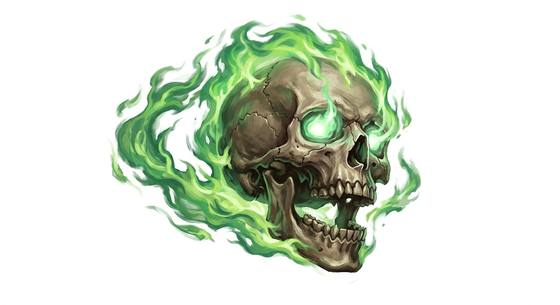

# Flaming skull

{.illus}

*Set: Expansion*

*aka: ______________________________*

*[Undead and deathless](../Species_Families/undead-and-deathless.md) · tiny other · hover · fantasy, horror*

A skull wrapped in green, flickering flame, floating through the air and cackling to itself. It drifts through crypts and dungeons, lighting the walls with a sickly glow, and its laugh echoes long after it has passed.

It hunts by circling just out of reach and spitting balls of fire at its prey. It is small and quick, and hard to hit. It fights to the death, and it seems to enjoy it. Adventurers deal with it by trapping it in a small space, or by using water or holy power. When it is finally destroyed, it bursts into a shower of bone and ash.

## Stat block

- **Attack** 14 · **Parry** — · **Dodge** 14 · **Armour** 2 · **Life** 8 · **Threat** minor+
- **Attacks:** bite 1d4
- **Attributes:** STR 2 DEX 15 AGI 15 END 8 INT 6 WIS 10 PER 14 CHA 4 COU 20
- **Skills:** [Stealth](../Skills/stealth.md) +3
- **Powers:** [Fire Blast](../Powers/fire-blast.md) 3, [Levitation](../Powers/levitation.md) 3
- **Behaviour:** circles out of reach and spits fire. **Morale:** fights to the death.

How to read this block: [Bestiary](../bestiary.md).

## Not to be confused with

the *[fire mote](fire-mote.md)*, a living spark of flame; the flaming skull is undead and spits fire from a skull.

