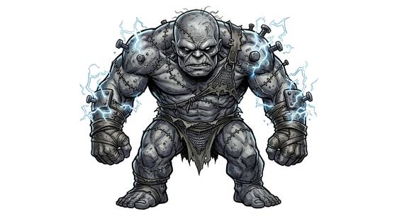

# Flesh golem

{.illus}

*Set: Expansion*

*aka: ______________________________*

*[Constructs and synthetics](../Species_Families/constructs-and-synthetics.md) · large biped · walk · fantasy, horror*

A body the size of two men, stitched together from the corpses of many. The seams show everywhere: a thick arm from one, a scarred leg from another, a patchwork face with mismatched eyes. It was quickened by a ritual or a bolt of lightning, and it still carries a faint crackle of that power, which seems to knit its wounds when it is struck by more.

It obeys its maker slowly and literally. It feels no fear. Badly hurt, it may lose all control and go berserk, smashing friend and foe alike, and more than one creator has died under its fists. Villagers fear it, burn the workshops that make it, and are sometimes surprised to find it gentler than they expected.

## Stat block

- **Attack** 19 · **Parry** — · **Dodge** 4 · **Armour** 1 · **Life** 36 · **Threat** 2
- **Attacks (2 a round):** slam 1d6+2
- **Attributes:** STR 22 DEX 8 AGI 8 END 20 INT 3 WIS 6 PER 6 CHA 1 COU 20
- **Skills:** [Lifting & Carrying](../Skills/lifting-and-carrying.md) +4, [Wrestling & Grappling](../Weapon_Groups/wrestling-and-grappling.md) +4
- **Powers:** [Toughness](../Powers/toughness.md) 2, [Healing Factor](../Powers/healing-factor.md) 1
- **Behaviour:** obeys its maker; may go berserk when badly damaged. **Morale:** mindless, never flees.

How to read this block: [Bestiary](../bestiary.md).

## Not to be confused with

The *[Hulking zombie brute](hulking-zombie-brute.md)*, a single raised corpse driven by hunger; the flesh golem is built from many bodies and obeys its maker.

