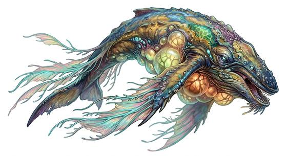

# Floating sky whale

{.illus}

*Set: Expansion*

*aka: ______________________________*

*[Aquatic](../Species_Families/aquatic.md) · gigantic flyer · slow flyer · fantasy, sci-fi*

A whale-shaped beast that swims through the upper sky, held aloft by great gas bladders along its sides. Pods of them drift above the clouds, long fins sculling slowly, feeding on the spores and tiny living things that float in the thin high air.

They are harmless unless provoked. Airship crews treat them with respect, follow them to find good winds and sometimes hunt them for their gas and oil. A wounded sky whale will lash out with its tail and ram, and a pod will close around a calf. Badly hurt, it sinks away into the clouds and sings its distress for days.

## Stat block

- **Attack** 14 · **Parry** — · **Dodge** -3 · **Armour** 2 · **Life** 68 · **Threat** 5
- **Attacks (3 a round):** slam 2d6+1
- **Attributes:** STR 26 DEX 4 AGI 4 END 28 INT 3 WIS 13 PER 17 CHA 10 COU 10
- **Skills:** [Weather Sense](../Skills/weather-sense.md) +5 (reroll 1)
- **Powers:** [Flight](../Powers/flight.md) 2, [Levitation](../Powers/levitation.md) 4, [Toughness](../Powers/toughness.md) 4
- **Behaviour:** drifts above clouds in pods; harmless unless provoked. **Morale:** flees when badly hurt.

How to read this block: [Bestiary](../bestiary.md).

## Not to be confused with

the *[colossal sun moth](colossal-sun-moth.md)*, another giant of the sky; the sky whale floats gently on gas and feeds on spores.

