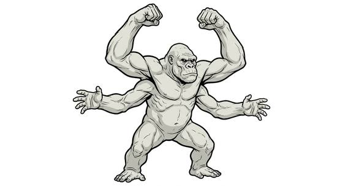

# Four-armed white ape

{.illus}

*Set: Expansion*

*aka: ______________________________*

*[Simian](../Species_Families/simian.md) · large biped · climber · sci-fi*

A huge, hairless ape with pale, leathery skin, a small skull and four long, heavily muscled arms. It haunts dead cities on dry worlds, lairing in the upper floors of ruined towers and dropping down on anything that wanders through the empty streets.

It batters prey with two fists while holding it pinned with the other two, and it fights to the death. Explorers of the ruins move in groups, keep to open squares and watch the windows above. A band of the apes is enough to empty a ruined city of anything smaller, and treasure hunters sometimes learn too late why no one has looted a place before them.

## Stat block

- **Attack** 21 · **Parry** — · **Dodge** 7 · **Armour** 1 · **Life** 31 · **Threat** 2
- **Attacks (2 a round):** slam 1d6+2
- **Attributes:** STR 22 DEX 11 AGI 11 END 19 INT 5 WIS 9 PER 9 CHA 3 COU 16
- **Skills:** [Climbing](../Skills/climbing.md) +5, [Intimidation](../Skills/intimidation.md) +5, [Brawling](../Weapon_Groups/brawling.md) +4
- **Powers:** —
- **Behaviour:** lairs in ruined cities; tears apart intruders with four arms. **Morale:** fights to the death.

How to read this block: [Bestiary](../bestiary.md).

## Not to be confused with

the *[four-armed cave brute](four-armed-cave-brute.md)*, which is squat and defends a single cave; the white ape is huge and haunts ruined cities.

