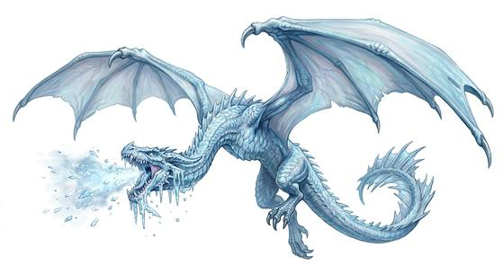

# Frost wyvern

{.illus}

*Set: Expansion*

*aka: ______________________________*

*[Draconic](../Species_Families/draconic.md) · large winged biped · flyer · fantasy*

A pale, two-legged dragon of glaciers and high passes, with blue-white scales, leathery wings and a long tail. It dives from snowstorms onto prey, breathing a freezing mist that coats it in rime, then carries it off.

It is immune to cold and flees when badly hurt. Mountain travellers watch the sky in snowstorms and carry fire. Its lair is a cave of ice filled with frozen bones.

## Stat block

- **Attack** 21 · **Parry** — · **Dodge** 9 · **Armour** 2 · **Life** 30 · **Threat** 3+
- **Attacks (2 a round):** great bite 2d6; talons 1d6+2
- **Attributes:** STR 20 DEX 13 AGI 13 END 18 INT 4 WIS 12 PER 16 CHA 6 COU 15
- **Skills:**, [Survival: Arctic](../Skills/survival-arctic.md) +5, [Hunting](../Skills/hunting.md) +4
- **Powers:** [Flight](../Powers/flight.md) 3, [Cold Blast](../Powers/cold-blast.md) 3, [Resist Element](../Powers/resist-element.md) 3
- **Behaviour:** dives from snowstorms; freezes prey before carrying it off. **Morale:** flees when badly hurt.

How to read this block: [Bestiary](../bestiary.md).

## Not to be confused with

the *[Fire Wyvern](fire-wyvern.md)*, a red-scaled wyvern of volcanic peaks that breathes flame.

