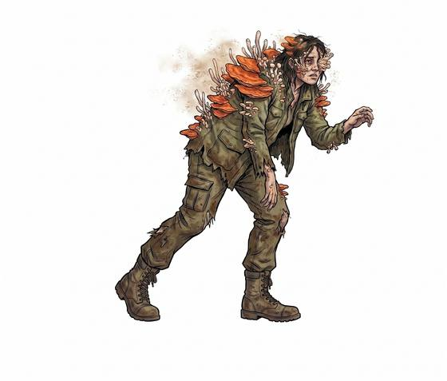

# Fungal zombie

{.illus}

*Set: Expansion*

*aka: ______________________________*

*[Fungal](../Species_Families/fungal.md) · medium biped · walk · horror, post-apocalyptic*

A person taken over by a parasitic fungus, still wearing the clothes of their last day. Pale growths push out from the skin at the neck and temples, and the eyes are cloudy and wet. The fungus drives the body hard: it runs at any sound, shrieking, and bites whatever it catches. The bite carries the spores, and the bitten turn within a day or so.

It is not undead, but something worse, a living body whose mind has been eaten. Survivors learn to move quietly, carry masks, and burn the dead. Some keep a last mercy ready for friends who have been bitten.

## Stat block

- **Attack** 16 · **Parry** — · **Dodge** 5 · **Armour** 0 · **Life** 20 · **Threat** minor+
- **Attacks:** bite 1d6+1
- **Attributes:** STR 12 DEX 8 AGI 8 END 14 INT 1 WIS 5 PER 8 CHA 1 COU 20
- **Skills:**, [Tracking](../Skills/tracking.md) +3
- **Powers:** [Disease](../Powers/disease.md) 2
- **Behaviour:** runs at noise; bite spreads the infection. **Morale:** mindless, never flees.

How to read this block: [Bestiary](../bestiary.md).

## Not to be confused with

*[Clicking fungal zombie](clicking-fungal-zombie.md)*, the later stage of the same infection, blind and hunting by sound, where the fresh host can still see and runs at noise.

