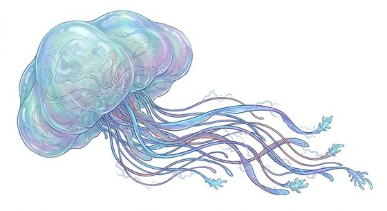

# Gasbag sky drifter

{.illus}

*Set: Expansion*

*aka: ______________________________*

*[Cephalopod and mollusc](../Species_Families/cephalopod-and-mollusc.md) · huge other · hover · sci-fi*

A huge, gas-filled bladder, translucent and pale, that drifts through the clouds of gas giants, trailing long, sparking tentacles below. It feeds on drifting organisms, catching them in its tentacles.

Its tentacles give off static shocks, stinging anything that touches them, and the sparks can be seen from far off. It flees at the first wound, rising up into the clouds. Sky miners avoid them, and pilots flying through gas giant clouds watch for the flicker of their tentacles. Some sky peoples tether them as living balloons.

## Stat block

- **Attack** 9 · **Parry** — · **Dodge** -1 · **Armour** 0 · **Life** 30 · **Threat** 1+
- **Attacks (2 a round):** tentacle lash 2d6
- **Attributes:** STR 14 DEX 4 AGI 4 END 16 INT 3 WIS 8 PER 11 CHA 6 COU 8
- **Skills:** [Weather Sense](../Skills/weather-sense.md) +5 (reroll 1)
- **Powers:** [Levitation](../Powers/levitation.md) 4, [Lightning](../Powers/lightning.md) 2
- **Behaviour:** floats in giant-planet skies; trails stinging, sparking tentacles. **Morale:** flees at first wound.

How to read this block: [Bestiary](../bestiary.md).

## Not to be confused with

the *[colossal jellyfish](colossal-jellyfish.md)*, which lives in the sea; the sky drifter floats in the clouds of gas giants.

