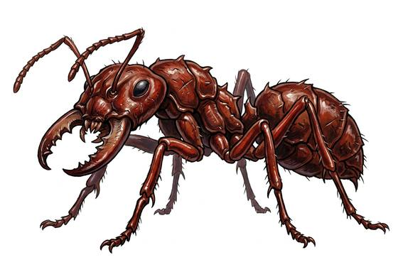

# Giant ant soldier

{.illus}

*Set: Core*

*aka: ______________________________*

*[Insectoid and arachnid](../Species_Families/insectoid-and-arachnid.md) · large many-legged · walk · fantasy, modern, post-apocalyptic*

The colony's defender: a giant ant half again as large as the workers, with a head that is mostly jaw and a sting curled under its abdomen. Soldiers are bred for one purpose. They crowd the mouth of the nest in ranks, and when an intruder comes they bite, hold and sting at the same moment, pumping venom into whatever their jaws have caught.

They do not retreat and do not break. A soldier fights until it is dead, and the ones behind climb over it to take its place. Raiders who want what lies inside a nest, the eggs sold to alchemists or the queen's royal jelly, go in with fire and smoke, or they tunnel in from another side and pray the soldiers do not notice.

## Stat block

- **Attack** 19 · **Parry** — · **Dodge** 7 · **Armour** 2 · **Life** 23 · **Threat** 3+
- **Attacks (2 a round):** mandibles 1d6+2; stinger 1d6+2
- **Attributes:** STR 17 DEX 11 AGI 11 END 15 INT 1 WIS 9 PER 9 CHA 2 COU 18
- **Skills:** [Tracking](../Skills/tracking.md) +3, [Intimidation](../Skills/intimidation.md) +3
- **Powers:** [Poison Touch](../Powers/poison-touch.md) 2, [Hive Mind](../Powers/hive-mind.md) 1
- **Behaviour:** guards the nest mouth; bites and stings together. **Morale:** fights to the death.

How to read this block: [Bestiary](../bestiary.md).

## Not to be confused with

the *[giant ant](giant-ant.md)*, the ordinary worker that forages along scent trails; the soldier stays home and kills.

