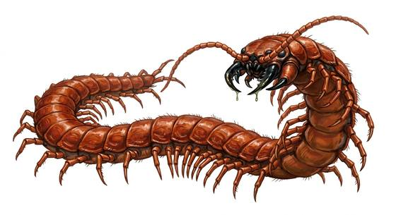

# Giant centipede

{.illus}

*Set: Expansion*

*aka: ______________________________*

*[Insectoid and arachnid](../Species_Families/insectoid-and-arachnid.md) · medium many-legged · climber · fantasy, horror*

A centipede as long as a man, flat and glossy red-brown, with a hundred legs that ripple like a curtain. It pours through cracks, under floorboards and into the gaps between stones, and it strikes at ankles and hands with curved poison claws before pulling back into its hole. The bite burns for days and brings fever.

It haunts cellars, crypts, ruined baths and warm, damp caves, and it is fast. People who have lived with one under the house talk of the sound more than the sight: a dry, scratching rush in the walls at night. Rat-catchers charge double. Terriers help, and so does a good pair of boots, but most householders simply move out.

## Stat block

- **Attack** 15 · **Parry** — · **Dodge** 12 · **Armour** 2 · **Life** 14 · **Threat** 1+
- **Attacks:** mandibles 1d6+1
- **Attributes:** STR 10 DEX 15 AGI 15 END 11 INT 1 WIS 10 PER 10 CHA 2 COU 13
- **Skills:** [Stealth](../Skills/stealth.md) +5, [Climbing](../Skills/climbing.md) +5
- **Powers:** [Poison Touch](../Powers/poison-touch.md) 2
- **Behaviour:** strikes from crevices at ankles, then retreats. **Morale:** flees when badly hurt.

How to read this block: [Bestiary](../bestiary.md).

## Not to be confused with

the *[colossal centipede](colossal-centipede.md)*, a jungle monster longer than a barge that coils and fights to the death; this one is man-length and prefers to strike and hide.

