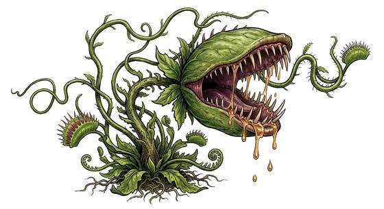

# Giant flytrap

{.illus}

*Set: Expansion*

*aka: ______________________________*

*[Plant-kind](../Species_Families/plant-kind.md) · large plant · rooted · fantasy, horror, sci-fi*

A man-sized plant with two hinged jaws lined with spines, sitting on a thick stalk rooted in swamps and jungles. Its lures smell sweet, of honey and fruit, and its jaws are brightly coloured to draw prey.

When anything brushes the lures, the jaws snap shut. The victim is trapped and slowly digested. It is rooted and cannot move, and it is mindless and never flees. It is easy to avoid once spotted, but in thick undergrowth it is easy to miss. Hunters cut the stalk or pry the jaws apart with spears, and jungle guides point them out to travellers.

## Stat block

- **Attack** 19 · **Parry** — · **Dodge** 8 · **Armour** 2 · **Life** 28 · **Threat** 2
- **Attacks:** great bite 2d6
- **Attributes:** STR 16 DEX 12 AGI 12 END 16 INT 0 WIS 6 PER 9 CHA 0 COU 20
- **Skills:** [Stealth](../Skills/stealth.md) +4
- **Powers:** [Hold](../Powers/hold.md) 2
- **Behaviour:** rooted; snaps shut on anything that brushes its lures. **Morale:** mindless, never flees.

How to read this block: [Bestiary](../bestiary.md).

## Not to be confused with

The *[Giant pitcher plant](giant-pitcher-plant.md)*, which drowns prey in a pool of digestive fluid; the giant flytrap snaps shut on its victims.

