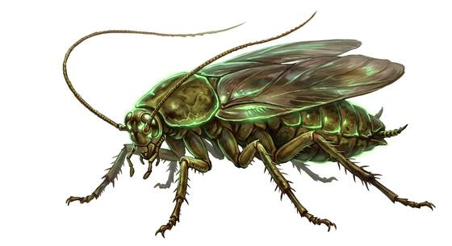

# Giant irradiated roach

{.illus}

*Set: Expansion*

*aka: ______________________________*

*[Insectoid and arachnid](../Species_Families/insectoid-and-arachnid.md) · small many-legged · fast runner · post-apocalyptic*

A roach the size of a cat, brown-shelled and faintly glowing green, with twitching feelers as long as its body. Roaches swarm over rubbish heaps, sewers and collapsed cellars in their dozens, eating anything, and they bite whatever comes close with hard little jaws. The bites itch and fester.

They scuttle away from bright light and flee at the first wound. One is a joke. A heap of them is a real hazard for a child or a sleeping traveller. Wastelanders stamp them, roast them and eat them, and say that they taste better than they look, which isn't saying much.

## Stat block

- **Attack** 9 · **Parry** — · **Dodge** 11 · **Armour** 2 · **Life** 9 · **Threat** minor
- **Attacks:** mandibles 1d4
- **Attributes:** STR 4 DEX 13 AGI 13 END 9 INT 1 WIS 7 PER 7 CHA 1 COU 9
- **Skills:** [Stealth](../Skills/stealth.md) +4, [Scavenging](../Skills/scavenging.md) +4
- **Powers:** [Radiation](../Powers/radiation.md) 1
- **Behaviour:** scuttles in groups; flees from bright light. **Morale:** flees at first wound.

How to read this block: [Bestiary](../bestiary.md).

## Not to be confused with

*[Giant beetle](giant-beetle.md)*, a large ordinary beetle, where the roach glows, swarms over rubbish and runs from light.

