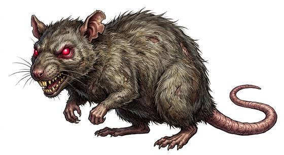

# Giant rat

{.illus}

*Set: Expansion*

*aka: ______________________________*

*[Rodent](../Species_Families/rodent.md) · small quadruped · walk · fantasy, horror*

A rat as big as a terrier, with yellow teeth, a naked tail and a coat matted with filth. Giant rats foul sewers, cellars, granaries and the holds of ships, and they come in numbers, pouring out of cracks in a squealing tide that bites at ankles and hands. Each bite risks a sickness that makes the wound swell black.

Singly they are cowards and flee at the first wound. Together they are bold, especially in the dark. Rat-catchers with terriers and ferrets do steady business in cities that have them, and a merchant who finds their droppings in his grain store knows the whole cargo is spoiled.

## Stat block

- **Attack** 12 · **Parry** — · **Dodge** 12 · **Armour** 0 · **Life** 10 · **Threat** minor+
- **Attacks:** small bite 1d4
- **Attributes:** STR 6 DEX 14 AGI 14 END 10 INT 2 WIS 11 PER 11 CHA 3 COU 10
- **Skills:** [Stealth](../Skills/stealth.md) +5, [Survival: Ruins & Wasteland](../Skills/survival-ruins-and-wasteland.md) +4
- **Powers:** [Disease](../Powers/disease.md) 1
- **Behaviour:** swarms in numbers; bites and spreads sickness. **Morale:** flees at first wound.

How to read this block: [Bestiary](../bestiary.md).

## Not to be confused with

the *[dog-sized rat](dog-sized-rat.md)*, a wolf-sized pack hunter bold enough to go after people; the giant rat is smaller and mostly a scavenger.

