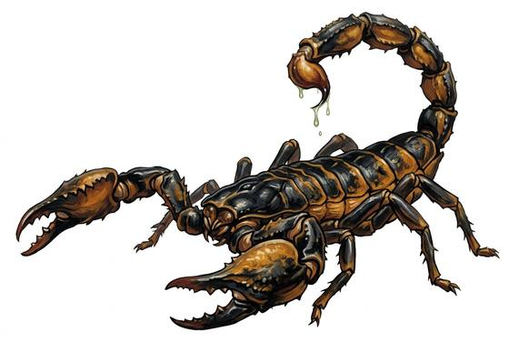

# Giant scorpion

{.illus}

*Set: Core*

*aka: ______________________________*

*[Insectoid and arachnid](../Species_Families/insectoid-and-arachnid.md) · large many-legged · walk · fantasy, modern, post-apocalyptic*

A desert scorpion the size of a horse, clad in sandy, overlapping plates that turn swords and arrows. It carries two great pincers in front and a jointed tail curled high over its back, tipped with a sting the size of a dagger. It hunts by feeling the tremors of footsteps through the sand, rushes out, grabs with both claws and drives the sting into whatever it holds.

It will fight to the death. Desert caravans post watchers at night and keep fires bright, since the scorpion hunts in the cool dark and glows faintly under some moonlight. Its venom is valued by poisoners and physicians both, and its shell makes fine shields, for whoever lives to take them.

## Stat block

- **Attack** 19 · **Parry** — · **Dodge** 8 · **Armour** 2 · **Life** 23 · **Threat** 3+
- **Attacks (2 a round):** pincers 1d6+2; stinger 1d6+2
- **Attributes:** STR 17 DEX 12 AGI 12 END 15 INT 1 WIS 10 PER 13 CHA 2 COU 16
- **Skills:** [Stealth](../Skills/stealth.md) +4, [Survival: Desert](../Skills/survival-desert.md) +5
- **Powers:** [Poison Touch](../Powers/poison-touch.md) 3
- **Behaviour:** grabs with claws and stings the held victim. **Morale:** fights to the death.

How to read this block: [Bestiary](../bestiary.md).

## Not to be confused with

the *[desert scorpion](desert-scorpion.md)*, an ordinary scorpion whose sting is dangerous but small; the giant scorpion is as big as a horse.

