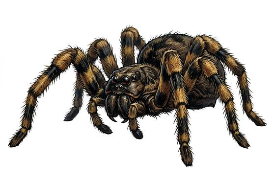

# Giant spider

{.illus}

*Set: Expansion*

*aka: ______________________________*

*[Insectoid and arachnid](../Species_Families/insectoid-and-arachnid.md) · large many-legged · climber · fantasy, horror*

A spider the size of a pony, all hairy knees and clustered black eyes. Some kinds spin webs of rope-thick silk across caves, ruined halls and forest paths; others dig a burrow and hide under a hinged lid of earth and moss, waiting for footsteps. Either way, prey is bitten, goes limp, and is wrapped in silk and dragged into the dark to be eaten later.

Old adventurers carry torches for more than light, since webs burn and spiders dislike fire. A tunnel with cocooned bundles hanging from the roof is a place to leave. The spider itself is no fool: if it is badly hurt it retreats up its lines into shadow, and waits for easier meat.

## Stat block

- **Attack** 18 · **Parry** — · **Dodge** 11 · **Armour** 2 · **Life** 22 · **Threat** 2+
- **Attacks:** fangs 1d6+2
- **Attributes:** STR 14 DEX 15 AGI 15 END 14 INT 1 WIS 12 PER 15 CHA 3 COU 14
- **Skills:** [Stealth](../Skills/stealth.md) +5, [Climbing](../Skills/climbing.md) +5 (reroll 1)
- **Powers:** [Poison Touch](../Powers/poison-touch.md) 2, [Entangle](../Powers/entangle.md) 2, [Wall Walking](../Powers/wall-walking.md) 3
- **Behaviour:** waits in webs or burrows; wraps and drags prey away. **Morale:** flees when badly hurt.

How to read this block: [Bestiary](../bestiary.md).

## Not to be confused with

the *[giant wolf spider](giant-wolf-spider.md)*, which spins no web and runs its prey down in the open instead of waiting for it.

