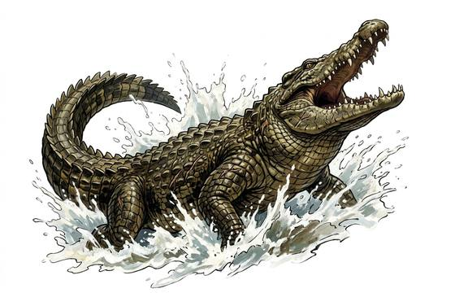

# Great crocodile

{.illus}

*Set: Core*

*aka: ______________________________*

*[Reptilian](../Species_Families/reptilian.md) · large quadruped · swimmer · fantasy, historical, modern, myth*

A huge armoured reptile of rivers, estuaries and coastal swamps, long as a boat and heavy as an ox. Its back is covered in bony plates, its eyes and nostrils sit on top of its head, and it can lie in the shallows for hours with nothing showing but those. It waits where animals come to drink.

When something steps close, the crocodile explodes from the water, seizes a leg or a snout, drags its victim under and rolls until it drowns. Once it has a grip it will not let go. River peoples fence their bathing places, never fetch water at the same spot twice and tell grim stories of beasts that have eaten whole villages, one by one.

## Stat block

- **Attack** 19 · **Parry** — · **Dodge** 5 · **Armour** 2 · **Life** 32 · **Threat** 2
- **Attacks:** great bite 2d6; tail 1d6+2
- **Attributes:** STR 20 DEX 9 AGI 9 END 18 INT 2 WIS 11 PER 11 CHA 4 COU 15
- **Skills:** [Stealth](../Skills/stealth.md) +5 (reroll 1), [Swimming](../Skills/swimming.md) +5 (reroll 1), [Wrestling & Grappling](../Weapon_Groups/wrestling-and-grappling.md) +5
- **Powers:** [Toughness](../Powers/toughness.md) 2
- **Behaviour:** waits at water's edge; seizes, drags under, rolls. **Morale:** fights to the death once it has a grip.

How to read this block: [Bestiary](../bestiary.md).

## Not to be confused with

The *[American Alligator](american-alligator.md)*, a broad-snouted swamp reptile that is slower to attack and quicker to back off when hurt.

