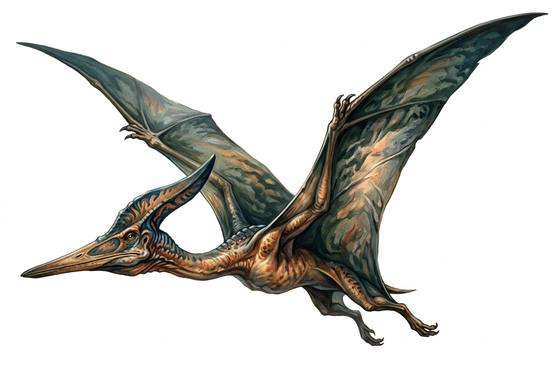

# Great pterosaur

{.illus}

*Set: Expansion*

*aka: ______________________________*

*[Reptilian](../Species_Families/reptilian.md) · large flyer · flyer · prehistoric, fantasy*

A crested flying reptile with a wingspan like a sailing boat's mainsail, a long toothless beak and a bony crest swept back from its head. It soars for hours on sea winds and cliff updrafts, barely beating its wings, and it hunts fish, small animals and anything else it can snatch from the ground or the water.

It can carry off a child, and it will try. Fishers watch the sky when they haul nets, and cliff villages keep their children indoors when the shadows pass over. It flees when badly hurt. Its crest and wing bones are prized as trophies and charms, and the brave climb to its nests for eggs.

## Stat block

- **Attack** 17 · **Parry** — · **Dodge** 9 · **Armour** 1 · **Life** 20 · **Threat** 1
- **Attacks:** talons 1d6+2; beak 1d6+1
- **Attributes:** STR 14 DEX 13 AGI 13 END 12 INT 2 WIS 13 PER 18 CHA 2 COU 13
- **Skills:**, [Hunting](../Skills/hunting.md) +4
- **Powers:** [Flight](../Powers/flight.md) 4
- **Behaviour:** snatches people from cliffs and boats. **Morale:** flees when badly hurt.

How to read this block: [Bestiary](../bestiary.md).

## Not to be confused with

the *[giant pterosaur](giant-pterosaur.md)*, which is far larger and stalks prey on the ground; the great pterosaur hunts from the air.

