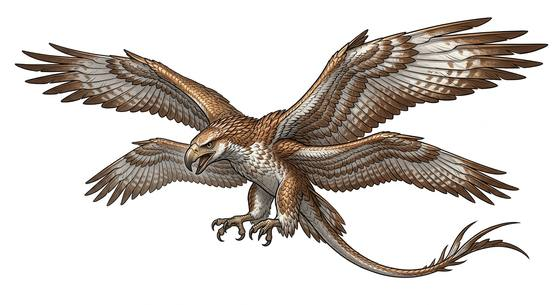

# Great sky raptor

{.illus}

*Set: Expansion*

*aka: ______________________________*

*[Reptilian](../Species_Families/reptilian.md) · huge winged quadruped · flyer · sci-fi*

The red-and-black king of the skies on its world, a huge, four-winged flyer with a vast wingspan, a crested head and jaws that can snatch lesser flyers mid-air. Its shadow sends every other creature to ground.

It hunts from above, diving on prey from high altitude, and nothing in the sky dares challenge it. It never looks up, because nothing hunts it. It fights to the death. To ride one is the greatest honour among the peoples of its world, and legend says only a hero can tame one. Most who try are eaten.

## Stat block

- **Attack** 24 (rerolls 1) · **Parry** — · **Dodge** 8 · **Armour** 2 · **Life** 41 · **Threat** 4
- **Attacks (2 a round):** great bite 2d6+1; talons 2d6
- **Attributes:** STR 27 DEX 13 AGI 13 END 23 INT 5 WIS 13 PER 18 CHA 8 COU 19
- **Skills:** (reroll 1), [Intimidation](../Skills/intimidation.md) +5 (reroll 1)
- **Powers:** [Flight](../Powers/flight.md) 5
- **Behaviour:** hunts from above; nothing in the sky dares challenge it. **Morale:** fights to the death.

How to read this block: [Bestiary](../bestiary.md).

## Not to be confused with

the *[four-winged cliff flyer](four-winged-cliff-flyer.md)*, a smaller flyer that bonds with riders; the sky raptor is the apex predator of the air.

