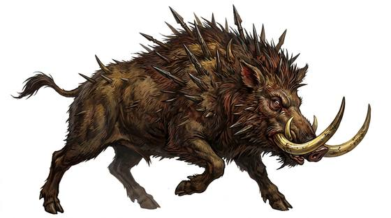

# Great tusked boar

{.illus}

*Set: Core*

*aka: ______________________________*

*[Ungulate](../Species_Families/ungulate.md) · large quadruped · walk · fantasy, myth, historical*

A boar the size of a plough-horse, with a ridge of bristles that stand up like a hedge of spear-points and tusks long enough to open a man from knee to chin. It does not simply feed on farmland; it unmakes it. Orchards are uprooted, walls pushed over, and a whole valley's harvest turned into mud in a single season. Villages send for heroes when they see the furrows.

It meets hunters head on and does not stop. Wounds that would drop an ox only make it angrier, and it fights until it dies. Every generation has its tale of a hunt for such a boar, and most of those tales list the names of the men who did not come home.

## Stat block

- **Attack** 22 · **Parry** — · **Dodge** 7 · **Armour** 2 · **Life** 36 · **Threat** 2
- **Attacks:** tusks 2d6
- **Attributes:** STR 22 DEX 11 AGI 11 END 25 INT 3 WIS 11 PER 11 CHA 4 COU 18
- **Skills:** [Intimidation](../Skills/intimidation.md) +5, [Pain Tolerance](../Skills/pain-tolerance.md) +5
- **Powers:** [Toughness](../Powers/toughness.md) 2
- **Behaviour:** ravages farmland; charges hunters head on. **Morale:** fights to the death.

How to read this block: [Bestiary](../bestiary.md).

## Not to be confused with

the *[Infernal Boar](infernal-boar.md)*, a hellish beast wreathed in fire; the great tusked boar is flesh and blood, only far too much of both.

