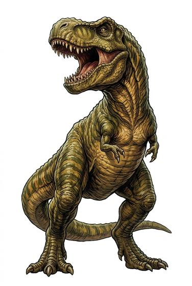

# Great tyrant lizard

{.illus}

*Set: Core*

*aka: ______________________________*

*[Reptilian](../Species_Families/reptilian.md) · gigantic biped · walk · prehistoric, fantasy, modern*

A two-legged predator as tall as a house, with a skull longer than a man, tiny arms and a bite that crushes bone. It is the apex hunter of its age, stalking herds of plant-eaters across floodplains and forest edges, following their scent and the sound of their movement.

When it strikes, it bites and shakes, tearing flesh and snapping bone. It ignores small attackers, brushing them aside like flies, and it fights to the death. Nothing in its world challenges it except another of its kind. Those who meet one learn fast: stay still, stay small, stay downwind, or find a hole too narrow for that head.

## Stat block

- **Attack** 23 (rerolls 1) · **Parry** — · **Dodge** 2 · **Armour** 2 · **Life** 56 · **Threat** 6
- **Attacks (3 a round):** great bite 2d6+2; stomp 2d6+1
- **Attributes:** STR 29 DEX 9 AGI 9 END 24 INT 2 WIS 12 PER 16 CHA 3 COU 17
- **Skills:** [Tracking](../Skills/tracking.md) +5, [Intimidation](../Skills/intimidation.md) +5 (reroll 2)
- **Powers:** [Toughness](../Powers/toughness.md) 3, [Enhanced Senses](../Powers/enhanced-senses.md) 1
- **Behaviour:** bone-crushing bite; shakes prey; ignores small attackers. **Morale:** fights to the death.

How to read this block: [Bestiary](../bestiary.md).

## Not to be confused with

the *[large theropod](large-theropod.md)*, a smaller, more agile hunter; the tyrant lizard is bigger, heavier and has the stronger bite.

