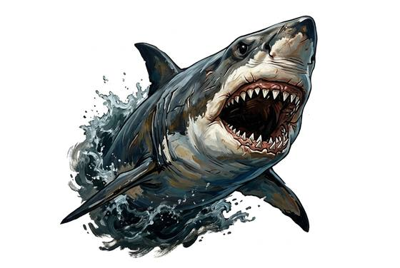

# Great white shark

{.illus}

*Set: Core*

*aka: ______________________________*

*[Aquatic](../Species_Families/aquatic.md) · large swimmer · swimmer · fantasy, historical, modern, horror*

A great torpedo-shaped fish, slate grey above and white below, with a crescent tail and rows of serrated triangular teeth. It hunts seals, big fish and dead whales along cold and temperate coasts, and it can smell blood in the water from miles away.

The great white hunts from below. It circles, then rises at speed from the depths and strikes whatever is silhouetted against the light, a seal, a surfer or a small boat. Once blood is in the water it may fall into a frenzy and fight to the death. Fishing villages tell of sharks that follow boats for days, and sailors have long believed that a shark trailing a ship means a death aboard.

## Stat block

- **Attack** 21 · **Parry** — · **Dodge** 9 · **Armour** 2 · **Life** 25 · **Threat** 2
- **Attacks:** great bite 2d6
- **Attributes:** STR 20 DEX 13 AGI 13 END 17 INT 2 WIS 12 PER 17 CHA 4 COU 15
- **Skills:** [Swimming](../Skills/swimming.md) +5 (reroll 3) (reroll 1), [Hunting](../Skills/hunting.md) +5
- **Powers:** [Enhanced Senses](../Powers/enhanced-senses.md) 3, [Water Breathing](../Powers/water-breathing.md) 5
- **Behaviour:** circles, then strikes from below; smells blood. **Morale:** fights to the death in a frenzy.

How to read this block: [Bestiary](../bestiary.md).

## Not to be confused with

The *[Bull Shark](bull-shark.md)*, a smaller, stockier shark that hunts murky shallows and even swims far up rivers.

