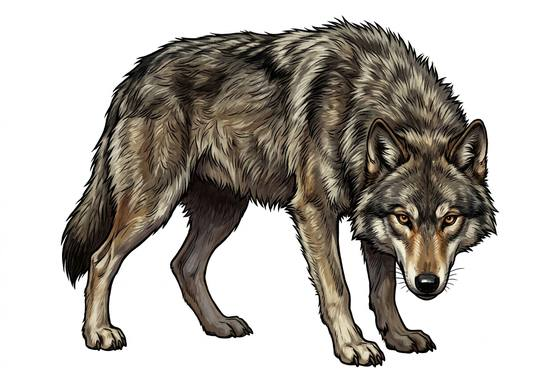

# Grey wolf

{.illus}

*Set: Core*

*aka: ______________________________*

*[Canine](../Species_Families/canine.md) · medium quadruped · fast runner · fantasy, historical, modern, post-apocalyptic, horror*

A lean grey hunter with long legs, a narrow chest and eyes the colour of weak tea. Wolves live in family packs and range across forest, tundra and open plain, trotting for hours without seeming to tire. They hunt by patience rather than fury: the pack follows a herd, tests it, and slowly peels away the old, the lame and the young until one animal stands alone and the circle closes.

Wolves are wary of people and will usually melt into the trees long before a traveller sees them. Hunger changes that. In hard winters they come down to the byres, and a lone rider on a snowbound road may hear the howling close in on both sides. Scatter the pack and the danger passes; kill the leaders and the rest lose heart.

## Stat block

- **Attack** 15 · **Parry** — · **Dodge** 11 · **Armour** 1 · **Life** 16 · **Threat** minor
- **Attacks:** bite 1d6+1
- **Attributes:** STR 10 DEX 14 AGI 14 END 12 INT 3 WIS 13 PER 17 CHA 6 COU 12
- **Skills:** [Tracking](../Skills/tracking.md) +5, [Stealth](../Skills/stealth.md) +3
- **Powers:** [Enhanced Senses](../Powers/enhanced-senses.md) 2
- **Behaviour:** hunts in packs; circles the weakest. **Morale:** fights while the pack fights.

How to read this block: [Bestiary](../bestiary.md).

## Not to be confused with

The *[Feral Dog](feral-dog.md)*, which runs in looser, hungrier packs around ruins and towns and has none of the wolf's discipline or fear of people.

