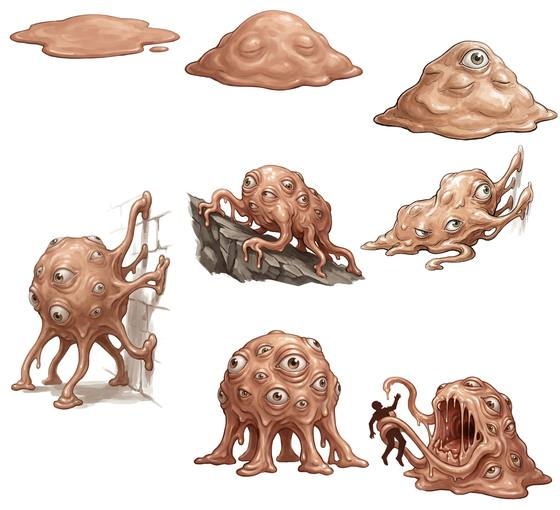

# Guardian eye orb

{.illus}

*Set: Expansion*

*aka: ______________________________*

*[Trans-dimensional](../Species_Families/trans-dimensional.md) · large other · walk, climb, hover · sentient · fantasy*

A mass of warm, pinkish flesh set to guard one place: a vault, a door, a treasure. At rest it lies flat and still as a spilled puddle, and most thieves step right over it. Touch what it guards and the puddle stirs. It swells into a mound, eyes open one by one across its skin, and it pushes out soft limbs to walk, to climb walls, or to lift itself off the ground and hang in the air.

Every eye can throw a small bolt of force, and a roused guardian has dozens. Its gaze can freeze a victim in place or scatter their thoughts. When it catches someone, a great maw splits open across its body. It does not bargain, does not tire and never leaves its post.

## Stat block

- **Attack** 17 · **Parry** — · **Dodge** 4 · **Armour** 2 · **Life** 30 · **Threat** 3+
- **Attacks (2 a round):** maw 1d6+2; grasping limb 1d6+2
- **Attributes:** STR 12 DEX 8 AGI 8 END 16 INT 16 WIS 15 PER 20 CHA 10 COU 18
- **Skills:** (reroll 3), [Trained Observation](../Skills/trained-observation.md) +5 (reroll 1), [Danger Sense](../Skills/danger-sense.md) +5, [Intimidation](../Skills/intimidation.md) +5
- **Powers:** [Energy Bolt](../Powers/energy-bolt.md) 3, [Hold](../Powers/hold.md) 3, [Confusion](../Powers/confusion.md) 2, [Mind Control](../Powers/mind-control.md) 2, [Levitation](../Powers/levitation.md) 2
- **Behaviour:** lies flat as a pool of flesh until its charge is touched; then rises, opens its eyes, grows limbs and fires small bolts from every eye; opens a great maw to feed. **Morale:** fights to the death.

How to read this block: [Bestiary](../bestiary.md).

## Not to be confused with

*[Brood-mother eye orb](brood-mother-eye-orb.md)*, a clever floating queen that breeds lesser orbs and bargains for its life; the guardian is a shapeless flesh-mass bound to one place that fights until it dies.

