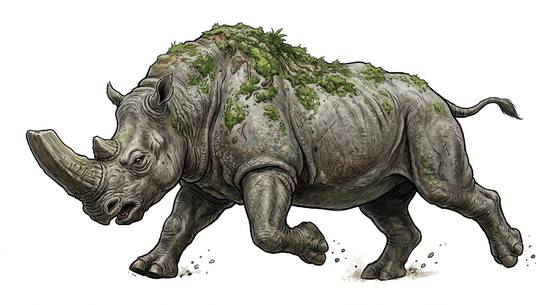

# Hammer-headed titan

{.illus}

*Set: Expansion*

*aka: ______________________________*

*[Ungulate](../Species_Families/ungulate.md) · huge quadruped · walk · sci-fi*

A rhino-like jungle giant with a broad hammer of a skull, a thick, armoured hide and a crest that flares brightly when it is angry. It browses the jungle in herds, feeding on leaves and low branches.

When threatened, the herd flares their head-crests, lowers their heads and charges together. Anything in their way is flattened. When badly hurt, they flee. Jungle travellers know to keep their distance and never come between a mother and her calf. Hunters prize their hides, but few are foolish enough to hunt them.

## Stat block

- **Attack** 20 · **Parry** — · **Dodge** 2 · **Armour** 2 · **Life** 40 · **Threat** 4
- **Attacks (2 a round):** horns 2d6+1; stomp 2d6
- **Attributes:** STR 26 DEX 7 AGI 7 END 29 INT 3 WIS 8 PER 8 CHA 4 COU 16
- **Skills:** [Intimidation](../Skills/intimidation.md) +5
- **Powers:** —
- **Behaviour:** herds flare head-crests, then charge together at threats. **Morale:** flees when badly hurt.

How to read this block: [Bestiary](../bestiary.md).

## Not to be confused with

the *[wild rhinoceros](wild-rhinoceros.md)*, a natural grazer; the hammer-headed titan is far larger and charges in herds.

