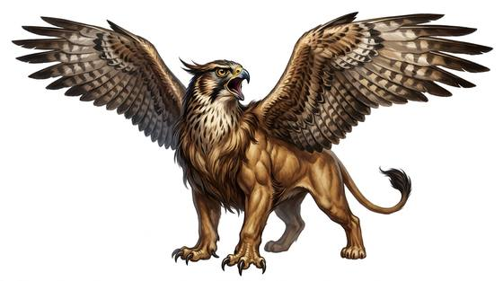

# Hawk-headed sphinx

{.illus}

*Set: Expansion*

*aka: ______________________________*

*[Hybrid and chimeric](../Species_Families/hybrid-and-chimeric.md) · large winged quadruped · flyer · fantasy, myth*

A lion's powerful body with a falcon's head and a pair of great wings. It hunts the desert sky, stooping on gazelles and stray camels, and its hooked beak strips a carcass fast. Unlike the riddling sphinxes it is often compared to, it is fierce, quick-tempered and, frankly, rather stupid.

It despises its wiser cousins and attacks them on sight, which is one of the few things desert peoples find useful about it. It flees when badly hurt, beating up into the heat haze. Temple carvings sometimes show it as noble; caravan masters, who know better, show it as a pest.

## Stat block

- **Attack** 21 · **Parry** — · **Dodge** 11 · **Armour** 2 · **Life** 26 · **Threat** 2
- **Attacks (2 a round):** claws 1d6+2; beak 1d6+1
- **Attributes:** STR 19 DEX 15 AGI 15 END 16 INT 4 WIS 12 PER 17 CHA 6 COU 15
- **Skills:** (reroll 1), [Hunting](../Skills/hunting.md) +5
- **Powers:** [Flight](../Powers/flight.md) 3
- **Behaviour:** hunts the desert sky; hates the wise sphinxes. **Morale:** flees when badly hurt.

How to read this block: [Bestiary](../bestiary.md).

## Not to be confused with

the *[Ram-headed Sphinx](ram-headed-sphinx.md)*, a patient temple guardian that stays on the ground and holds its post.

