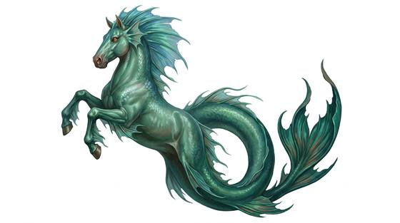

# Hippocamp

{.illus}

*Set: Expansion*

*aka: ______________________________*

*[Equine and centauroid](../Species_Families/equine-and-centauroid.md) · large swimmer · swimmer · fantasy, myth*

A horse to the shoulders, a great fish from the ribs back. The forequarters are sleek and short-haired, with webbed hooves that paddle like oars, while the hindquarters taper into a long, scaled tail with a broad fin. Hippocamps breathe water as easily as air and move through the surf in powerful, rolling bounds.

Sea peoples catch them young, gentle them and harness them in teams to shell chariots and war-sleds. A tamed hippocamp is loyal and brave, but a wild one fights with hooves and teeth when cornered and flees into deep water once badly hurt. Fishermen count a glimpse of a herd running on the waves as a good omen.

## Stat block

- **Attack** 16 · **Parry** — · **Dodge** 10 · **Armour** 1 · **Life** 24 · **Threat** 2
- **Attacks:** hooves 1d6+2; bite 1d6+2
- **Attributes:** STR 17 DEX 14 AGI 14 END 16 INT 4 WIS 11 PER 11 CHA 9 COU 11
- **Skills:** [Swimming](../Skills/swimming.md) +5 (reroll 2), [Wayfinding](../Skills/wayfinding.md) +4
- **Powers:** [Water Breathing](../Powers/water-breathing.md) 3
- **Behaviour:** pulls sea-chariots; can be tamed by sea-folk. **Morale:** flees when badly hurt.

How to read this block: [Bestiary](../bestiary.md).

## Not to be confused with

the *[Four-finned Sea Steed](four-finned-sea-steed.md)*, a swimming mount of a different build; the hippocamp keeps a horse's head, neck and forelegs above its fish tail.

