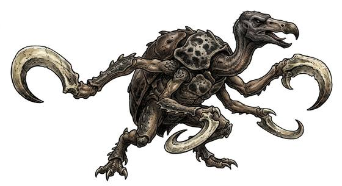

# Hook-armed cave hunter

{.illus}

*Set: Expansion*

*aka: ______________________________*

*[Insectoid and arachnid](../Species_Families/insectoid-and-arachnid.md) · large biped · climber · fantasy*

A tall, beetle-shelled hunter with a vulture's beak and arms that end in great curved hooks. It climbs the walls of vast caverns with ease. Hook-armed hunters live in family groups, and they talk and hunt by clacking their beaks against their shells: the sound echoes off the stone, and they listen for where it bounces.

They fight while the pack fights, and flee when the family breaks. Travellers who hear clacking from the dark ahead know they are being hunted, and that there will be more than one. Some underground peoples keep them at bay with drums that confuse the echoes.

## Stat block

- **Attack** 20 · **Parry** 17 · **Dodge** 6 · **Armour** 2 · **Life** 27 · **Threat** 4
- **Attacks (2 a round):** blade arms 1d6+2; beak 1d6+1
- **Attributes:** STR 20 DEX 10 AGI 10 END 17 INT 5 WIS 12 PER 12 CHA 5 COU 15
- **Skills:** [Climbing](../Skills/climbing.md) +5 (reroll 1), [Tracking](../Skills/tracking.md) +5, [Stealth](../Skills/stealth.md) +3
- **Powers:** [Radar Sense](../Powers/radar-sense.md) 2
- **Behaviour:** clacks to call kin; hunts in family groups. **Morale:** fights while the pack fights.

How to read this block: [Bestiary](../bestiary.md).

## Not to be confused with

*[Blind cave crawler](blind-cave-crawler.md)*, a pale pack hunter that clicks and drags victims away, where the hook-armed hunter is a large, armoured climber.

