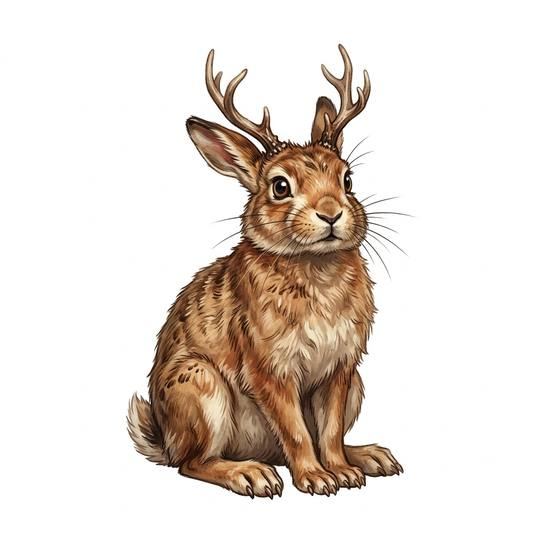

# Horned hare

{.illus}

*Set: Core*

*aka: ______________________________*

*[Lagomorph](../Species_Families/lagomorph.md) · tiny quadruped · fast runner · fantasy, myth, modern*

A hare, quick and long-eared, but with a pair of small antlers or a single stubby horn sprouting from its forehead. It is shy and startles easily, running at the first sight of a person and fleeing at the first wound. At night, some say, it mimics voices in the dark, calling cheeky echoes back to lost travellers.

It is prized as a trophy by liars. Mounted heads hang in taverns everywhere, most of them made from an ordinary hare and a pair of fawn's antlers, and the real thing is rarely caught. Hunters swear the best bait is a flask of good spirits, which also explains most of the sightings.

## Stat block

- **Attack** 9 · **Parry** — · **Dodge** 16 · **Armour** 0 · **Life** 6 · **Threat** minor
- **Attacks:** horns 1d6
- **Attributes:** STR 3 DEX 17 AGI 17 END 8 INT 3 WIS 12 PER 12 CHA 8 COU 6
- **Skills:** [Jumping](../Skills/jumping.md) +5 (reroll 1), [Stealth](../Skills/stealth.md) +5, [Running](../Skills/running.md) +5
- **Powers:** —
- **Behaviour:** flees; mimics voices at night. **Morale:** flees at first wound.

How to read this block: [Bestiary](../bestiary.md).

## Not to be confused with

the *[Wild Rabbit](wild-rabbit.md)*, an ordinary hornless animal that is easy to catch and does not mimic anything.

