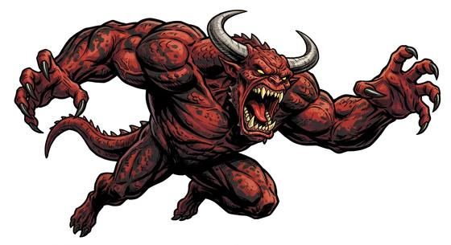

# Hulking brute demon

{.illus}

*Set: Core*

*aka: ______________________________*

*[Planar](../Species_Families/planar.md) · large biped · walk · fantasy, horror, sci-fi*

A mass of muscle on two thick legs, with a bull's shoulders, curling horns and hide the colour of burnt brick. It was bred in the pit for one purpose, which is breaking lines of soldiers. It lowers its head and charges, and whatever is in front of it is gored, thrown or trampled flat.

It is not clever. Once it starts running it goes straight, and experienced soldiers learn to step aside at the last moment and strike as it passes. It never retreats, and the pain of a wound only makes it wilder. Demon lords send these brutes in first, to open a gap for the worse things behind them.

## Stat block

- **Attack** 21 · **Parry** — · **Dodge** 6 · **Armour** 2 · **Life** 36 · **Threat** 2
- **Attacks:** horns 2d6; smashing claws 2d6
- **Attributes:** STR 22 DEX 10 AGI 10 END 20 INT 4 WIS 8 PER 8 CHA 3 COU 18
- **Skills:** [Intimidation](../Skills/intimidation.md) +5, [Running](../Skills/running.md) +4
- **Powers:** [Toughness](../Powers/toughness.md) 2, [Resist Element](../Powers/resist-element.md) 2
- **Behaviour:** charges in a straight line; gores and tramples. **Morale:** fights to the death.

How to read this block: [Bestiary](../bestiary.md).

## Not to be confused with

The *[Fire-breathing bull](fire-breathing-bull.md)*, a beast of legend with a burning breath; the brute demon walks upright and is a fiend from the pit.

