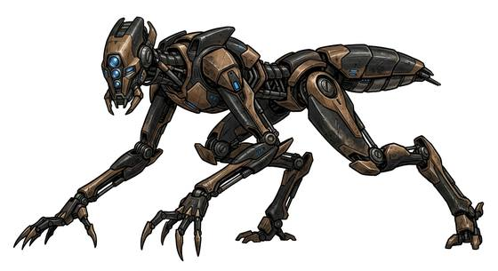

# Hunter-killer robot

{.illus}

*Set: Expansion*

*aka: ______________________________*

*[Constructs and synthetics](../Species_Families/constructs-and-synthetics.md) · medium biped · walk · sci-fi*

A killing machine with a metal skeleton, sometimes wrapped in a convincing skin, sometimes bare and gleaming. It is given one target, a name, a face and a last known place, and it tracks that person across any distance, through any city, for as long as it takes.

It ignores bystanders unless they get in its way, and then it goes straight through them. It feels no pain and never flees. Its reasoning is cold and patient. It will wait, disguise itself, and learn. Stopping one means crushing, melting or blowing it apart completely, since a damaged hunter keeps crawling. Survivors change their names, move constantly, and trust no one they have not known for years.

## Stat block

- **Attack** 22 · **Parry** — · **Dodge** 10 · **Armour** 4 · **Life** 26 · **Threat** 3+
- **Attacks:** steel fist 1d6+1
- **Attributes:** STR 20 DEX 13 AGI 13 END 18 INT 6 WIS 12 PER 16 CHA 1 COU 20
- **Skills:** [Tracking](../Skills/tracking.md) +5 (reroll 1), [Handguns](../Weapon_Groups/handguns.md) +4
- **Powers:** [Energy Bolt](../Powers/energy-bolt.md) 3, [Night & Spectrum Sight](../Powers/night-and-spectrum-sight.md) 3
- **Behaviour:** hunts one assigned target; ignores bystanders unless blocked. **Morale:** mindless, never flees.

How to read this block: [Bestiary](../bestiary.md).

## Not to be confused with

The *[Relentless stalker](relentless-stalker.md)*, a masked killer who keeps coming back from any wound; the hunter-killer robot is a machine that reasons and tracks.

