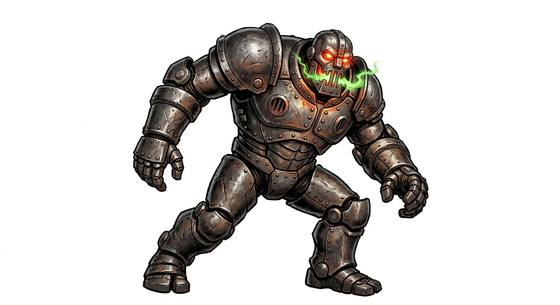

# Iron golem

{.illus}

*Set: Expansion*

*aka: ______________________________*

*[Constructs and synthetics](../Species_Families/constructs-and-synthetics.md) · large biped · slow · fantasy*

A towering figure of forged iron plates, bolted and riveted over a hollow frame, with a grille for a mouth. It is slow and heavy, and the floor groans under it. Swords skid off it and arrows ring and fall. It is set to guard one place, a vault, a gate, a tomb, and it will stand there until the iron rusts through.

When it fights, a green vapour leaks from the grille, and when enemies crowd around it breathes a cloud of poison gas. It never retreats. The wise do not try to beat it head-on: they avoid its post, lure it into a pit, or learn the word that stills it. Rust, and patience, are its only true enemies.

## Stat block

- **Attack** 23 · **Parry** — · **Dodge** 3 · **Armour** 6 · **Life** 46 · **Threat** 10+
- **Attacks:** iron fist 1d6+2
- **Attributes:** STR 28 DEX 7 AGI 7 END 24 INT 2 WIS 8 PER 8 CHA 1 COU 20
- **Skills:** [Lifting & Carrying](../Skills/lifting-and-carrying.md) +5 (reroll 1), [Brawling](../Weapon_Groups/brawling.md) +5
- **Powers:** [Toughness](../Powers/toughness.md) 3, [Resist Element](../Powers/resist-element.md) 3, [Poison Touch](../Powers/poison-touch.md) 2
- **Behaviour:** guards one place; breathes poison when surrounded. **Morale:** mindless, never flees.

How to read this block: [Bestiary](../bestiary.md).

## Not to be confused with

The *[Brass golem](brass-golem.md)*, a furnace-hearted guardian that vents flame; the iron golem is heavier, slower, and breathes poison.

