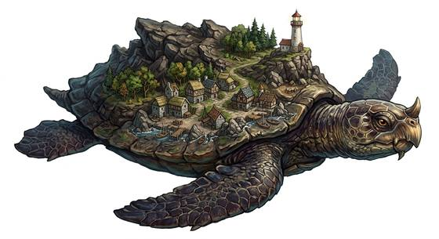

# Island turtle

{.illus}

*Set: Expansion*

*aka: ______________________________*

*[Reptilian](../Species_Families/reptilian.md) · gigantic swimmer · slow swimmer · fantasy, myth*

A sea turtle so enormous that soil has gathered on its shell over the centuries, and trees, birds and whole villages have grown there. Most of the people living on it have no idea. They farm, marry and bury their dead on what they think is an island, and it drifts slowly across the ocean while they do.

The turtle sleeps. It notices nothing that happens on its back until someone lights a large fire, and then it feels the heat and dives. There is no fighting it and no reasoning with it. The only thing to do is learn the signs, keep the fires small and have a boat ready.

## Stat block

- **Attack** 19 · **Parry** — · **Dodge** -4 · **Armour** 6 · **Life** 76 · **Threat** 20+
- **Attacks (3 a round):** great bite 2d6+2
- **Attributes:** STR 30 DEX 3 AGI 3 END 35 INT 3 WIS 12 PER 12 CHA 6 COU 20
- **Skills:** (reroll 3), [Swimming](../Skills/swimming.md) +5
- **Powers:** [Toughness](../Powers/toughness.md) 5, [Invulnerability](../Powers/invulnerability.md) 2, [Water Breathing](../Powers/water-breathing.md) 5
- **Behaviour:** sleeps for centuries; dives when a fire is lit on its back. **Morale:** mindless, never flees.

How to read this block: [Bestiary](../bestiary.md).

## Not to be confused with

the *[island whale](island-whale.md)*, another sleeper mistaken for land; the island turtle carries forests and villages and sleeps for centuries.

