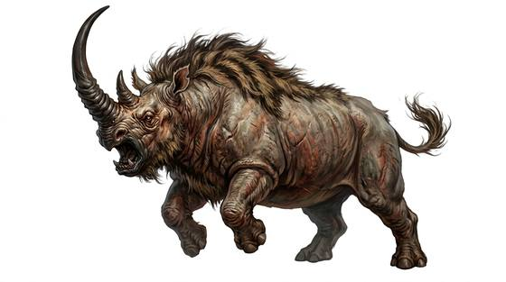

# Karkadann

{.illus}

*Set: Core*

*aka: ______________________________*

*[Ungulate](../Species_Families/ungulate.md) · large quadruped · walk · fantasy, myth, historical*

A ferocious grey-hided beast of the open steppe, heavier than a rhinoceros, with a single black horn curving from its snout. It is so strong that it can impale a charging elephant and lift it overhead on its horn. It hates all other large beasts, and its roar sets herds running.

Almost nothing tames it. Some say it grows calm only in the company of ring-doves, and will lie quietly under a tree where they coo. Otherwise it charges anything that comes close and fights until it dies. Its horn is prized for drinking cups that are said to reveal poison.

## Stat block

- **Attack** 22 · **Parry** — · **Dodge** 5 · **Armour** 2 · **Life** 37 · **Threat** 2
- **Attacks:** horns 2d6
- **Attributes:** STR 23 DEX 9 AGI 9 END 26 INT 3 WIS 9 PER 9 CHA 3 COU 19
- **Skills:** [Intimidation](../Skills/intimidation.md) +5
- **Powers:** [Toughness](../Powers/toughness.md) 2
- **Behaviour:** gores elephants; tame only near ring-doves. **Morale:** fights to the death.

How to read this block: [Bestiary](../bestiary.md).

## Not to be confused with

the *[Wild Rhinoceros](wild-rhinoceros.md)*, an ordinary animal that is dangerous but does not seek out and gore elephants.

