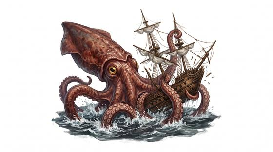

# Kraken

{.illus}

*Set: Expansion*

*aka: ______________________________*

*[Cephalopod and mollusc](../Species_Families/cephalopod-and-mollusc.md) · gigantic swimmer · swimmer · fantasy, myth, historical*

The dread of every deep-water sailor: a squid-like horror as big as an island, with arms long enough to wrap a warship's masts and suckers that can tear planks from a hull. It lives in the black water far below, and ships know it is there only when the sea begins to heave and the first arm slides over the rail.

A kraken takes a ship apart piece by piece, stripping sails, snapping masts and pulling sailors into the sea. It fights to the death, and cannon, fire and harpoons are all the same to it. Most who see one do not live to describe it, which is why the stories disagree.

## Stat block

- **Attack** 25 (rerolls 1) · **Parry** — · **Dodge** 5 · **Armour** 2 · **Life** 66 · **Threat** 7+
- **Attacks (3 a round):** great bite 2d6+2; tentacle lash 2d6+1
- **Attributes:** STR 30 DEX 12 AGI 12 END 28 INT 4 WIS 12 PER 12 CHA 6 COU 18
- **Skills:** [Swimming](../Skills/swimming.md) +5 (reroll 2), [Wrestling & Grappling](../Weapon_Groups/wrestling-and-grappling.md) +5 (reroll 2), [Stealth](../Skills/stealth.md) +4
- **Powers:** [Water Breathing](../Powers/water-breathing.md) 5, [Toughness](../Powers/toughness.md) 4, [Darkness](../Powers/darkness.md) 2
- **Behaviour:** rises beneath ships; tears them apart limb by limb. **Morale:** fights to the death.

How to read this block: [Bestiary](../bestiary.md).

## Not to be confused with

the *[giant squid](giant-squid.md)*, a real deep-sea hunter the size of a boat; the kraken is a gigantic monster that breaks warships.

