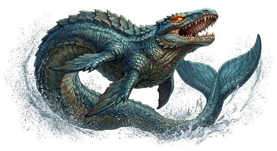

# Leviathan

{.illus}

*Set: Expansion*

*aka: ______________________________*

*[Aquatic](../Species_Families/aquatic.md) · gigantic serpentine · swimmer · fantasy, myth, horror*

The greatest beast of the sea: a scaled monster so long that its head and tail are rarely seen at the same time, with eyes that glow like coals and a hide no weapon can pierce. Its passing churns the ocean white, whirlpools open behind it, and waves roll out to drown distant coasts.

The leviathan rules an ocean the way a king rules a land. It does not hunt ships so much as crush them in passing. It fights to the death, and it has never been known to die. In most stories only a god, or the end of the world, can finish it. Sensible folk simply pray it stays asleep.

## Stat block

- **Attack** 24 (rerolls 2) · **Parry** — · **Dodge** 2 · **Armour** 6 · **Life** 76 · **Threat** 20++
- **Attacks (3 a round):** great bite 2d6+2; tail 2d6+1
- **Attributes:** STR 30 DEX 9 AGI 9 END 30 INT 4 WIS 13 PER 13 CHA 8 COU 20
- **Skills:** [Swimming](../Skills/swimming.md) +5 (reroll 3), [Diving](../Skills/diving.md) +5 (reroll 3), [Intimidation](../Skills/intimidation.md) +5 (reroll 2)
- **Powers:** [Toughness](../Powers/toughness.md) 5, [Water Control](../Powers/water-control.md) 4, [Invulnerability](../Powers/invulnerability.md) 2, [Fear](../Powers/fear.md) 3
- **Behaviour:** rules an ocean; whirlpools and tidal waves follow it. **Morale:** fights to the death.

How to read this block: [Bestiary](../bestiary.md).

## Not to be confused with

the *[world-encircling serpent](world-encircling-serpent.md)*, a creature that lies coiled around the whole world; the leviathan rules a single ocean.

