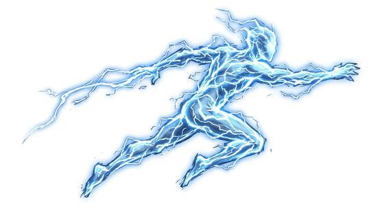

# Lightning elemental

{.illus}

*Set: Expansion*

*aka: ______________________________*

*[Elemental-kind](../Species_Families/elemental-kind.md) · medium other · flyer · fantasy, myth*

A crackling, flickering shape of living lightning, blue-white and never quite still. It moves faster than the eye can follow, leaping from place to place in bright flashes, and the air around it smells sharp and burnt. Hair stands on end when it draws near.

It is drawn to metal and leaps between iron fittings, swords and armour, striking the armoured first. It is mindless and never flees. Knights learn quickly to strip off their mail, and wise travellers drop their blades and lie flat. Summoners call them up during storms, and some towers built to catch lightning have one trapped at the top.

## Stat block

- **Attack** 23 · **Parry** — · **Dodge** 17 · **Armour** 0 · **Life** 18 · **Threat** 2+
- **Attacks:** shock touch 1d6+1
- **Attributes:** STR 12 DEX 20 AGI 20 END 12 INT 3 WIS 8 PER 11 CHA 2 COU 20
- **Skills:** [Acrobatics](../Skills/acrobatics.md) +5
- **Powers:** [Lightning](../Powers/lightning.md) 4, [Flight](../Powers/flight.md) 3, [Super Speed](../Powers/super-speed.md) 2
- **Behaviour:** leaps between metal objects; strikes the armoured first. **Morale:** mindless, never flees.

How to read this block: [Bestiary](../bestiary.md).

## Not to be confused with

The *[Lightning hawk](lightning-hawk.md)*, a living bird that carries storms on its wings; the lightning elemental is pure living lightning with no body.

