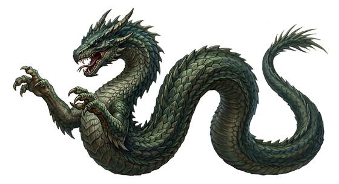

# Lindworm

{.illus}

*Set: Core*

*aka: ______________________________*

*[Draconic](../Species_Families/draconic.md) · large serpentine · walk, slow · fantasy, myth, historical*

A great wingless serpent with a dragon's head and a single pair of clawed forelegs, which it uses to haul its long body along behind it. It moves slowly, with a sound like a heavy sack being dragged over gravel, and it leaves a broad, slimy furrow wherever it has been.

Lindworms favour old roads, lonely crossroads and overgrown churchyards, and country folk swear they are drawn to graves. A lindworm coils around a traveller, crushes the breath out of them and bites with fangs that carry a slow, burning venom. It does not flee. Villages plagued by one hire a hero, bribe it with cattle, or move away.

## Stat block

- **Attack** 19 · **Parry** — · **Dodge** 5 · **Armour** 2 · **Life** 32 · **Threat** 3+
- **Attacks (2 a round):** great bite 2d6; constrict 1d6+2
- **Attributes:** STR 20 DEX 9 AGI 9 END 20 INT 3 WIS 11 PER 14 CHA 5 COU 15
- **Skills:** [Stealth](../Skills/stealth.md) +4, [Wrestling & Grappling](../Weapon_Groups/wrestling-and-grappling.md) +5
- **Powers:** [Poison Touch](../Powers/poison-touch.md) 2
- **Behaviour:** haunts churchyards and roads; coils around travellers. **Morale:** fights to the death.

How to read this block: [Bestiary](../bestiary.md).

## Not to be confused with

the *[great dragon-worm](great-dragon-worm.md)*, a far vaster limbless beast that wraps whole hills; the lindworm is smaller, has forelegs and hunts along roads.

