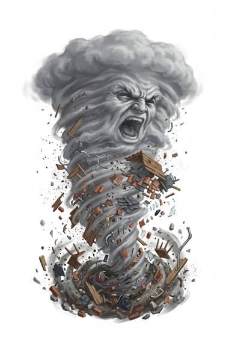

# Living tornado

{.illus}

*Set: Expansion*

*aka: ______________________________*

*[Elemental-kind](../Species_Families/elemental-kind.md) · huge other · flyer · fantasy, myth*

A roaring funnel of wind reaching from the ground to the clouds, with a will of its own. It moves across open plains and farmland with purpose, turning towards farmhouses and roads rather than wandering at random.

It lifts everything in its path, people, carts, livestock and roofs, and hurls them far away. It is mindless and never flees. There is no fighting it, only sheltering in cellars and ditches. Folk of the plains recognise the difference between a natural storm and a living one: the living one turns back to finish the job.

## Stat block

- **Attack** 24 · **Parry** — · **Dodge** 13 · **Armour** 0 · **Life** 38 · **Threat** 3+
- **Attacks (2 a round):** slam 2d6
- **Attributes:** STR 24 DEX 18 AGI 18 END 20 INT 1 WIS 6 PER 6 CHA 1 COU 20
- **Skills:** [Acrobatics](../Skills/acrobatics.md) +4, [Lifting & Carrying](../Skills/lifting-and-carrying.md) +5
- **Powers:** [Wind Control](../Powers/wind-control.md) 5, [Flight](../Powers/flight.md) 4, [Kinetic Push & Pull](../Powers/kinetic-push-and-pull.md) 3
- **Behaviour:** tears across open ground; flings people and carts. **Morale:** mindless, never flees.

How to read this block: [Bestiary](../bestiary.md).

## Not to be confused with

The *[Dust devil](dust-devil.md)*, a small spinning whirlwind that plagues camps; the living tornado is a huge storm with a will.

