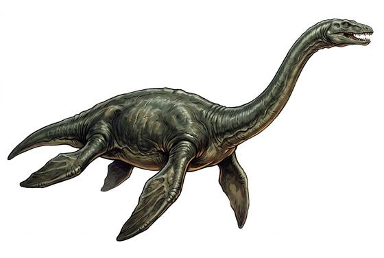

# Long-necked sea reptile

{.illus}

*Set: Expansion*

*aka: ______________________________*

*[Reptilian](../Species_Families/reptilian.md) · huge swimmer · swimmer · prehistoric, fantasy*

A flippered sea reptile with a small head, sharp teeth and a snake-like neck as long as its body. It rows through the water with four great paddles, darting its head sideways into schools of fish. It lives in open seas and deep lakes, and it snaps at boats and swimmers from beneath.

Sometimes it raises its head from the water, and sailors and lake folk tell of a serpent rising from the waves. Some say it survives in the deepest lakes even now, and some folk go looking. It flees when badly hurt. Those who live by the water keep an eye on the ripples and keep their feet out of the lake.

## Stat block

- **Attack** 20 · **Parry** — · **Dodge** 7 · **Armour** 2 · **Life** 32 · **Threat** 3
- **Attacks (2 a round):** bite 2d6
- **Attributes:** STR 22 DEX 12 AGI 12 END 18 INT 2 WIS 12 PER 12 CHA 2 COU 14
- **Skills:** [Swimming](../Skills/swimming.md) +5 (reroll 2), [Fishing](../Skills/fishing.md) +5
- **Powers:** [Water Breathing](../Powers/water-breathing.md) 1
- **Behaviour:** snaps at boats and swimmers from beneath. **Morale:** flees when badly hurt.

How to read this block: [Bestiary](../bestiary.md).

## Not to be confused with

the *[long-necked lake beast](long-necked-lake-beast.md)*, the monster of legend; the sea reptile is a real ancient animal with the same shape.

